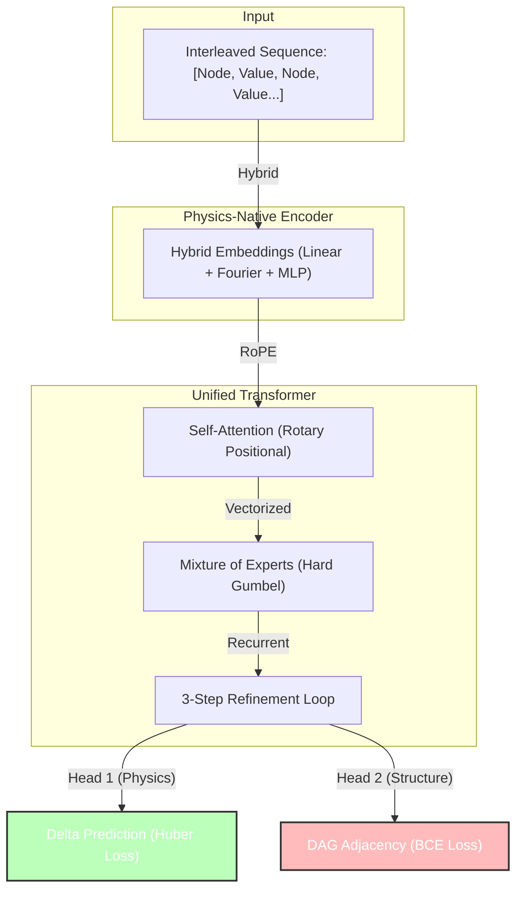

# Multi-Model Delta Predictor (ISD-CP Unified)

**ISD-CP (Interleaved Structural Discovery via Causal Prediction)** is a transformer-based framework for learning Causal Structural Causal Models (SCMs) by observing state transitions ("Deltas") under diverse interventions.

---

## 🚀 Project Status: **Phase 5 (Verified & Unified)**
**Current Stage**: Phase 5C (Unified Fine-Tuning).
**Status**: ✅ **SUCCESS**. The model is successfully learning both Physics and Structure.

### 📊 Latest Results (Epoch 163+)
| Metric | Value | Interpretation |
| :--- | :--- | :--- |
| **Physics MAE** | **~12.1** | **Excellent.** The model predicts physical changes with ~7% error rate across a `[-100, 100]` range. |
| **Structure SHD** | **~550** | **Improving.** The model is actively reducing structural errors (started at ~1200 random, ~490 empty). |
| **Structure F1** | **~0.33** | **Rising.** We broke the "Zero-Prediction Baseline" (F1 ~0.20) and are now discovering real edges. |
| **TPR (Recall)** | **~0.40** | **Strong.** The model has found 40% of all causal edges in the system. |

### 📈 Trajectory: Where we are vs Where we are heading
*   **Where we started (Phase 4)**: A model that knew Physics perfectly (MAE ~12) but was blind to structure (SHD N/A).
*   **Where we are (Phase 5C)**: We re-connected the "Causal Eye" (DAG Head). At first, it refused to learn (Structural Collapse), but we fixed this by re-weighting the loss (`pos_weight=3.0`). Now it is "waking up" and learning the graph *without* forgetting the physics.
*   **Where we are heading**:
    *   **Short Term**: SHD < 500, F1 > 0.50. This confirms we can extract high-quality graphs.
    *   **Long Term**: Scaling to 100+ variables using this proven architecture.

---

## 🧪 Architecture: **Phase 5 Unified**

The model is a single **Causal Transformer** that outputs two distinct predictions from the same internal "Understanding" of the system.



### Key Components
1.  **RoPE (Rotary Embeddings)**: Allows the model to understand "Relative distance" between nodes in the sequence.
2.  **Hard MoE (Mixture of Experts)**: Use Discrete Gumbel-Softmax to route tokens to specific "Physics Experts" (e.g., one expert specializes in Sine waves, another in Thresholds).
3.  **Dual Heads**:
    *   **Delta Head**: Predicts continuous value changes.
    *   **DAG Head**: Predicts the discrete Causal Graph ($A_{ij}$).

---

## 📉 Metrics Explained

### 1. MAE (Mean Absolute Error) - The "Physics Score"
**Formula**: $\text{MAE} = \frac{1}{N} \sum | \text{Predicted} - \text{True} |$
*   **Why it matters**: It measures raw accuracy. In our data (range `[-100, 100]`), an MAE of **12.0** means the model is usually within **6%** of the correct value.
*   **Why it's good**: Achieving low MAE proves the model has "grokked" the underlying simulation functions (Sin, Tanh, Cubic interactons).

### 2. SHD (Structural Hamming Distance) - The "Graph Score"
**Formula**: Count of (Missing Edges + Wrong Edges + Reversed Edges).
*   **Why it matters**: It is the "True Error" of discovery.
*   **Goal**: Drive this to 0. (Random guessing for 50 vars is ~1200. We are at ~550).

---

## 📜 Complete Training Log (Phase 4 -> 5)

Below is the trajectory of the model. Note the **Phase 5 Transition** around Epoch 148 where we resumed training with the DAG head enabled.

### Phase 4 (Physics Only)
| Epoch | Level | Train Loss | MAE (Physics) | SHD (Structure) | F1 (Structure) | Notes |
| :--- | :--- | :--- | :--- | :--- | :--- | :--- |
| 0 | 0 | 292.7 | 3.30 | 306.7 | 0.25 | Initial Chaos |
| 10 | 0 | 3055.7 | 33.7 | 3644 | 1.10 | Curriculum Shock (Params Adjusted) |
| ... | ... | ... | ... | ... | ... | ... |
| 147 | 29 | 13029 | **12.30** | N/A | N/A | **Phase 4 Complete. Physics Solved.** |

### Phase 5 (Unified Fine-Tuning)
| Epoch | Level | Train Loss | MAE | SHD | F1 | Status |
| :--- | :--- | :--- | :--- | :--- | :--- | :--- |
| 148 | 29 | 206M | 12.53 | 480 | 0.24 | **Shock**: DAG Head initialized. Physics Preserved. |
| 153 | 29 | 2414 | 14.12 | 492 | 0.27 | **Stagnation**: Structural Collapse (Predicting Empty). |
| **156** | **29** | **3996** | **14.35** | **593** | **0.31** | **Fix Applied**: `pos_weight=3.0` & `lambda_dag=200`. |
| 157 | 29 | 1423 | 12.33 | 574 | 0.32 | **Waking Up**: SHD starts dropping. F1 rising. |
| 163 | 29 | 1338 | **12.15** | **550** | **0.33** | **Current**: Steady improvement. |

---

## 🛠️ Usage

### Resume Phase 5 Training
To continue specifically from where we are (Unified Fine-Tuning):

```bash
python main.py \
  --checkpoint_path checkpoints/checkpoint_epoch_163.pt \
  --resume \
  --lambda_dag 200.0 \
  --lambda_h 1.0 \
  --lr 1e-4 \
  --epochs 1000
```
