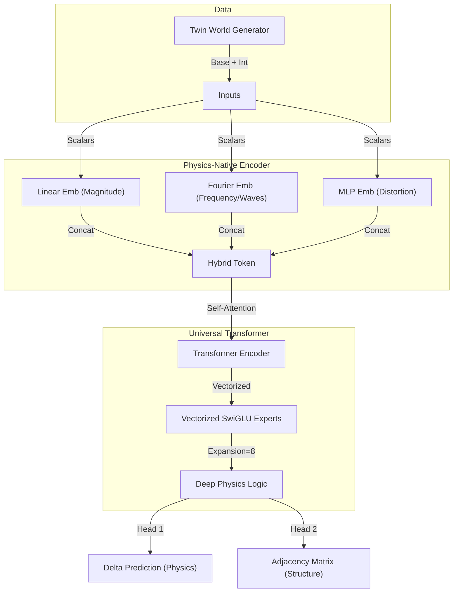

# Multi-Model Delta Predictor (ISD-CP Unified)

**ISD-CP (Interleaved Structural Discovery via Causal Prediction)** is a transformer-based framework for learning Causal Structural Causal Models (SCMs) by observing state transitions ("Deltas") under diverse interventions.

This repository implements the **Phase 3 "Physics-Native" Architecture**.

---

## 📅 Project Phases

### Phase 1: Exploration & The "Model Zoo"
*   **Goal**: Find the best architectural priors for causal discovery.
*   **Method**: We implemented 5 competing architectures:
    *   **Model A (Baseline)**: Simple Transformer.
    *   **Model B (Experts)**: Mixture of Experts (MoE).
    *   **Model C (Sparsity)**: L1 regularization emphasis.
    *   **Model D (Masked)**: Masked language modeling approach.
    *   **Model E (HyperNet)**: HyperNetwork generating weights from intervention IDs.
*   **Result**: "Experts" (B) and "HyperNet" (E) showed the most promise.

### Phase 2: Unification & "Twin World"
*   **Goal**: Scale up and reduce variance.
*   **Innovation 1 (Unification)**: Combined the best of A-E into a single `CausalTransformer`.
*   **Innovation 2 (Data)**: Introduced **Twin World** generation.
    *   *Concept*: Observe the *exact same* noise sample/person twice: once naturally, once intervened.
    *   *Math*: $\Delta = \text{State}_{Int} - \text{State}_{Obs}$.
*   **Innovation 3 (Tokenization)**: **Interleaved Tokens**. Sequence becomes `[Var1, Val1, Var2, Val2...]`.

### Phase 3: The Physics-Native Engine (Unified)


---

## 🔬 Technical Deep Dive

This section details the internal mechanics of the **Physics-Native Architecture**.

### 1. Hybrid Tokenization ("All-Seeing Eyes")
Standard transformers use simple Linear embeddings. Our model must understand *physics* (waves, thresholds, magnitudes). We implemented a **Hybrid Embedding** strategy that gives the model three simultaneous "views" of every number:

| Component | Share of Dimension | Purpose | Math |
| :--- | :--- | :--- | :--- |
| **Linear** | 25% | **Exact Magnitude** | $W_1 x + b_1$ |
| **Fourier** | 50% | **Periodicity/Waves** | $\text{MLP}([\sin(2^k \pi x), \cos(2^k \pi x)])$ for $k \in [0,7]$ |
| **MLP** | 25% | **Distortion/Chaos** | $\text{Linear} \to \text{GELU} \to \text{Linear}$ |

These are concatenated and mixed to form the final `Value Token`.

### 2. Interleaved Sequence Structure
To predict the effect of an intervention on the *entire system*, we serialize the graph state into a sequence of tokens:
`Sequence = [ID_0, Val_0, ID_1, Val_1, ..., ID_N, Val_N]`
*   **Type Embedding**: We add a learned vector to `Val_k` if node $k$ is intervened.
*   **Result**: The Transformer sees "Node 0 has value 5.2 (Observed)" and "Node 3 has value 10.0 (Intervened)".

### 3. Vectorized Mixture of Experts (MoE)
Predicting physics requires different "laws" for different variables. We use a **Mixture of Experts** layer.
*   **Old Way (Loop)**: Iterate `for expert in experts`. (Slow, serial).
*   **New Way (Vectorized)**: We treat experts as a tensor dimension `(Num_Experts, Dim_In, Dim_Out)`.
    *   **Mechanism**: `torch.einsum('ted, edh -> teh', x, weights)`
    *   **Benefit**: Computes all 8 experts for all tokens in parallel in a single GPU kernel.
*   **SwiGLU**: We use Swish-Gated Linear Units with **Expansion Factor 8**, making the experts "wide" (high memorization capacity).

### 4. Loss Function Hierarchy
We optimize for multiple objectives simultaneously:
1.  **Delta Loss (Huber)**: `SmoothL1(Predicted_Delta, Real_Delta)`. (Primary Physics Goal).
2.  **DAG Loss (BCE)**: Binary Cross Entropy on the Adjacency Matrix. (Structure Goal).
3.  **Acyclicity (Trace Exp)**: $\text{Trace}(e^{A \circ A}) - d = 0$. Enforces that the learned graph is a DAG (no loops).
4.  **Sparsity (L1)**: Penalizes dense graphs to encourage Occam's Razor.

---

## 🛠️ Data Pipeline ("Physics 2.0")

### SCM Generator
We simulate complex physical systems, not just linear graphs.
*   **Functions**: `Linear`, `Sin`, `Cos`, `Tanh`, `Sigmoid`, `Step`, `Quadratic`, `Cubic`.
*   **Interactions**: 30% of nodes combine parents multiplicatively ($A \times B$) to effectively simulate "Modulation".

### Twin World Caching
To stabilize training, we use a **Reuse Factor**.
*   **Process**: Generate 1 Graph $\to$ Train on it for $N$ epochs $\to$ Discard.
*   **Benefit**: The model "studies" the specific physics of that unique universe/graph before moving on.

---

## 🚀 Usage

### Requirements
*   PyTorch 2.0+
*   Reference Machine: 4x A100 (runs on 1 GPU fine via DDP auto-scaling).

### Training (Single Command)
```bash
# Start fresh (Phase 3 Architectures are incompatible with old checkpoints)
torchrun --nproc_per_node=4 main.py \
    --epochs 5000 \
    --lr 2e-5 \
    --batch_size 16 \
    --reuse_factor 5
```

### Key Arguments
*   `--metrics`: Shows `MAE` (Physics Error) and `SHD` (Graph Error).
*   `--reuse_factor`: How many times to repeat a graph (Default: 5).
*   `--max_vars`: Maximum graph size (Default: 50).

---

## 📂 Directory Structure

```
src/
├── data/
│   ├── SCMGenerator.py    # Physics Engine (Graphs, Functions)
│   ├── CausalDataset.py   # Twin World Pipeline & Caching
│   └── encoder.py         # Hybrid Embeddings (Fourier+Linear)
├── models/
│   └── CausalTransformer.py # Vectorized MoE + Backbone
├── training/
│   ├── loss.py            # Prioritized Loss (Delta > DAG)
│   └── curriculum.py      # Difficulty Scheduler
└── main.py                # DDP Entry Point
```
