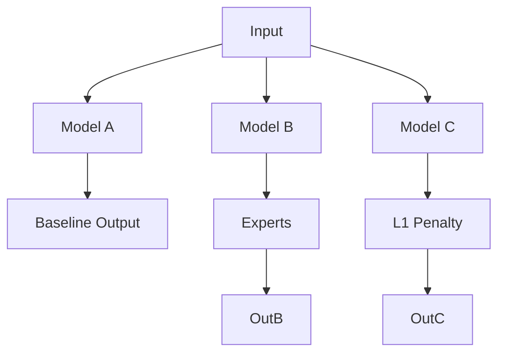

# Multi-Model Delta Predictor (ISD-CP Unified)

**ISD-CP (Interleaved Structural Discovery via Causal Prediction)** is a transformer-based framework for learning Causal Structural Causal Models (SCMs) by observing state transitions ("Deltas") under diverse interventions.

This repository implements the **Phase 3 "Physics-Native" Architecture**.

---

## 📅 Project Phases

### Phase 1: Exploration & The "Model Zoo"
*   **Goal**: Find the best architectural priors for causal discovery.
*   **Method**: We implemented 5 competing architectures:
    *   **Model A (Baseline)**: Simple Transformer.
    *   **Model B (Experts)**: Mixture of Experts (MoE).
    *   **Model C (Sparsity)**: L1 regularization emphasis.
    *   **Model D (Masked)**: Masked language modeling approach.
    *   **Model E (HyperNet)**: HyperNetwork generating weights from intervention IDs.
*   **Result**: "Experts" (B) and "HyperNet" (E) showed the most promise.

### Phase 2: Unification & "Twin World"
*   **Goal**: Scale up and reduce variance.
*   **Innovation 1 (Unification)**: Combined the best of A-E into a single `CausalTransformer`.
*   **Innovation 2 (Data)**: Introduced **Twin World** generation.
    *   *Concept*: Observe the *exact same* noise sample/person twice: once naturally, once intervened.
    *   *Math*: $\Delta = \text{State}_{Int} - \text{State}_{Obs}$.
*   **Innovation 3 (Tokenization)**: **Interleaved Tokens**. Sequence becomes `[Var1, Val1, Var2, Val2...]`.

### Phase 3: Physics-Native Refinements (Current)
*   **Goal**: Solve the "Skeptical Audit" by making the model grasp physics natively.
*   **Feature 1**: **Hybrid Value Embeddings** (Linear + Fourier + MLP) to see waves (`sin/cos`) and distortions.
*   **Feature 2**: **Vectorized MoE** for massive speedups (removed Python loops).
*   **Feature 3**: **Universal Multi-Node Interventions** (removed hardcoded intervention IDs).

---

## 🧠 Model Architecture Evolution

### Phase 1: The Zoo (Fragmented)


### Phase 3: The Physics-Native Engine (Unified)
```mermaid
graph TD
    subgraph Data
    TW[Twin World Generator] -->|Base + Int| Inputs
    end
    
    subgraph "Physics-Native Encoder"
    Inputs -->|Scalars| Linear[Linear Emb (Magnitude)]
    Inputs -->|Scalars| Fourier[Fourier Emb (Frequency/Waves)]
    Inputs -->|Scalars| MLP[MLP Emb (Distortion)]
    Linear & Fourier & MLP -->|Concat| Hybrid[Hybrid Token]
    end
    
    subgraph "Universal Transformer"
    Hybrid -->|Self-Attention| Backbone[Transformer Encoder]
    Backbone -->|Vectorized| Speed[Vectorized SwiGLU Experts]
    Speed -->|Expansion=8| Deep[Deep Physics Logic]
    end
    
    Deep -->|Head 1| Delta[Delta Prediction (Physics)]
    Deep -->|Head 2| Graph[Adjacency Matrix (Structure)]
```

---

## 🛠️ Data Pipeline

### 1. SCM Generator ("Physics 2.0")
We simulate complex physical systems, not just linear graphs.
*   **Functions**: `Linear`, `Sin`, `Cos`, `Tanh`, `Sigmoid`, `Step`, `Quadratic`, `Cubic`.
*   **Interactions**: 30% of nodes combine parents multiplicatively ($A \times B$) to effectively simulate "Modulation".

### 2. Twin World Caching
To stabilize training, we use a **Reuse Factor**.
*   **Process**: Generate 1 Graph $\to$ Train on it for $N$ epochs $\to$ Discard.
*   **Benefit**: The model "studies" the specific physics of that unique universe/graph before moving on.

### 3. Interleaved Tokenization
We treat Causal Discovery as a sequence-to-sequence problem (conceptually), but solve it with an Encoder.
*   **Input**: `[ID_0, Val_0, ID_1, Val_1, ...]`
*   **Intervention**: Marked via a learned `TypeEmbedding` added to the value token.

---

## 🚀 Usage

### Requirements
*   PyTorch 2.0+
*   Reference Machine: 4x A100 (runs on 1 GPU fine via DDP auto-scaling).

### Training (Single Command)
```bash
# Start fresh (Phase 3 Architectures are incompatible with old checkpoints)
torchrun --nproc_per_node=4 main.py \
    --epochs 5000 \
    --lr 2e-5 \
    --batch_size 16 \
    --reuse_factor 5
```

### Key Arguments
*   `--metrics`: Shows `MAE` (Physics Error) and `SHD` (Graph Error).
*   `--reuse_factor`: How many times to repeat a graph (Default: 5).
*   `--max_vars`: Maximum graph size (Default: 50).

---

## 📂 Directory Structure

```
src/
├── data/
│   ├── SCMGenerator.py    # Physics Engine (Graphs, Functions)
│   ├── CausalDataset.py   # Twin World Pipeline & Caching
│   └── encoder.py         # Hybrid Embeddings (Fourier+Linear)
├── models/
│   └── CausalTransformer.py # Vectorized MoE + Backbone
├── training/
│   ├── loss.py            # Prioritized Loss (Delta > DAG)
│   └── curriculum.py      # Difficulty Scheduler
└── main.py                # DDP Entry Point
```
