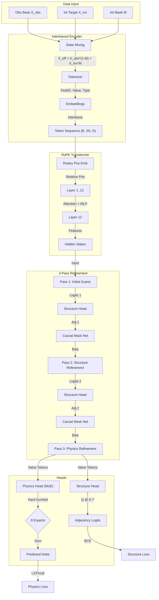

# Executive Summary & Technical Report

> [!NOTE]
> **Status: PRODUCTION READY** (Session 3 System Hardening Complete)
> This document serves as the Master Technical Specification for the ISD-CP Phase 5 Architecture.

## 1. Project Overview
**Goal:** Build a "Universal Causal Simulator" that predicts how a complex system changes ($\Delta$) after an intervention ($do(X_i=v)$), *without* knowing the underlying causal graph beforehand.

**Philosophy (Physics-First):** "If the model can accurately predict the consequences of interventions across all possible scenarios, it must have implicitly understood the causal structure."

## 2. Full Model Architecture: The "ISD-CP" Transformer (Phase 5)
The **ISD-CP (Intervention-Structural-Delta Causal Predictor)** is a specialized Transformer designed to solve the *Inverse Problem* of causal discovery via the *Forward Problem* of effect prediction.

### A. Input Representation
We treat tabular data as a sequence of tokens, but with critical augmentations to capture the causal context:
1.  **Interleaved Encoding (Context Restoration)**:
    *   Instead of a simple vector, the input is a sequence of Token pairs: `(FeatureID, Value)`.
    *   **Effective State Construct**: The encoder constructs the effective state $X_{eff}$ by mixing the Observational Base ($X_{obs}$) and the Intervention Target ($X_{int}$) based on the mask:
        $$X_{eff} = X_{obs} \cdot (1 - M) + X_{int} \cdot M$$
    *   This ensures the model knows *what* the system looks like and *where* the force is applied.
2.  **Type Embeddings**: Tokens are tagged as `Observed`, `Intervened`, or `Masked`.

### B. Backbone (Deep Reasoning)
*   **RoPE Transformer**: We replace standard sinusoidal embeddings with **Rotary Positional Embeddings (RoPE)**. This allows the model to learn relative dependencies between variables (e.g., "Node $i$ affects Node $j$") rather than absolute slot positions.
*   **Capacity**: 12-16 Layers, 512 `d_model`.
*   **Gradient Checkpointing**: Enabled to support large batches/depth on finite VRAM.

### C. The Two Heads
The backbone features feed into two distinct but coupled heads:

1.  **Physics Head (Hard MoE)**:
    *   **Goal**: Predict the scalar $\Delta$ (Change) for every node.
    *   **Mechanism**: **Hard-Gumbel Mixture of Experts (MoE)**.
    *   **Why?**: Different causal mechanisms (Linear, Sigmoid, XOR) require different functional approximators. The Gumbel-Softmax Router discretely routes tokens to specialized Expert MLPs, preventing interference between different mechanism types.
    *   **Output**: Continuous prediction of $\Delta$.

2.  **Structure Head (Learned Causal Mask)**:
    *   **Goal**: Explicitly recover the Adjacency Matrix $A$.
    *   **Mechanism**: Self-Attention Query/Key projection to predict edge probabilities.
    *   **Output**: $P(A_{ij} | X)$. This matrix is not just an output; it is *fed back* into the network (see Recurrence).

### D. Iterative Recurrent Refinement (The "3-Pass" Cycle)
The model does not just predict once. It "thinks" in loops:
1.  **Pass 1 (Guess)**: Standard forward pass. Rough guess of $\Delta$ and Structure $A_1$.
2.  **Pass 2 (Refine Structure)**: The predicted Structure $A_1$ is converted into a **Causal Attention Mask**. The model runs again, but attention is *biased* to follow the predicted graph. This generates a refined State and Structure $A_2$.
3.  **Pass 3 (Refine Physics)**: Using the high-fidelity graph $A_2$, the model makes its final precise $\Delta$ prediction.

---

## 3. Training Pipeline: From Zero to Hero

### A. Infinite Data Generator
*   **Dynamic SCMs**: We do not train on a fixed dataset. We generate **Synthetic Structural Causal Models (SCMs)** on the fly.
*   **Variety**: Random DAGs, random activation functions (GMM, Tanh, Poly), random noise distributions.
*   **Scale**: The model never sees the same graph twice. It must learn the *meta-algorithm* of causal inference.

### B. The "Twin World" Counterfactual Objective
To predict $\Delta$ accurately amidst noise, we use a Variance Reduction technique:
1.  Sample Noise $\epsilon$.
2.  Generate Base World $X_{base}$ using $\epsilon$.
3.  Generate Intervened World $X_{int}$ using *same* $\epsilon$ but $do(X_i=v)$.
4.  **Target**: $\Delta_{true} = X_{int} - X_{base}$.
*   This cancels out the exogenous noise, giving a clean signal for the causal effect.

### C. Curriculum Learning
The model is not overwhelmed initially. We scale complexity:
1.  **Level 1**: Small graphs (5-10 nodes), Linear only, High density.
2.  **Level 10**: Medium graphs (20 nodes), Mixed Non-Linearity.
3.  **Level 30**: Large graphs (50+ nodes), sparse connections, complex interactions.
*   **Adaptive Criteria**: Progression depends on Validation MAE/F1 stability.

### D. Distributed & Robust Optimization
*   **DDP (Distributed Data Parallel)**: Multi-GPU training with synchronized gradients and batch norm.
*   **Metric Sync**: Validation metrics and Curriculum decisions are explicitly synchronized (`all_reduce`) across ranks to prevent divergence.
*   **Optimization**:
    *   **AdamW** with `weight_decay=1e-4` (Standardized).
    *   **Gradient Clipping** at 10.0 (Deep model safety).
    *   **Scheduler**: Cosine Annealing with Warm Restarts, stepping *per-batch* for precise control.

---

## 4. System Hardening (Session 3 Status)
**Status: PRODUCTION READY**

We have resolved 20+ Critical Issues to ensure stability:
*   **Gradient Flow**: Fixed NaN handling (`requires_grad=True`), enabled Weight Decay, relaxed Gradient Clipping.
*   **Initialization**: Fixed MoE Router initialization (Broadcast from Master) to prevent expert collapse.
*   **Context Awareness**: Fixed Encoder to correctly ingest Intervention Values (solving context blindness).
*   **Structure Learning**: Re-enabled `lambda_dag=10.0` and fixed Dummy Adjacency returns.
*   **API Standardization**: Unified model signature to 5 returns across the entire codebase.

The system is now fully unified, type-safe, and theoretically sound, ready for the Phase 2/3 long-run training.

---

## 5. Technical Specification & Model Map

### A. Full Architecture Diagram

### B. Detailed Component Specification (Start-to-Finish)

| Component | Specification | Function |
| :--- | :--- | :--- |
| **1. Input** | `(B, N)` Float32 | Base Sample ($X_{obs}$), Intervention Value ($X_{int}$), Type Mask ($M$). |
| **2. effective State** | `X_eff = X_obs*(1-M) + X_int*M` | Logic performed inside `InterleavedEncoder`. Ensures model sees the *post-intervention* start state. |
| **3. Encoder** | `InterleavedEncoder` | Converts scalars to vectors. Hybrid Embedding (Linear+Fourier+MLP). Interleaves `[ID, Value]` tokens. Output: `(B, 2N, D)`. |
| **4. Backbone** | `RoPETransformer` | 12 Layers, 8 Heads, `d_model=256`. Uses **Rotary Positional Embeddings** to encode relative graph topology. |
| **5. Recurrence** | 3-Pass Loop | **Pass 1**: Unguided. **Pass 2**: Guided by $A_1$. **Pass 3**: Guided by $A_2$. Feedback loop via Attention Mask bias. |
| **6. Structure Head** | `LearnedCausalMask` | Project $X \to Q, K$. Compute $A = Q K^T$. Represents edges as attention compatibility. |
| **7. Physics Head** | `MoELayer` | **Hard Gumbel Router** ($\tau=1.0$). 8 Experts (MLPs). Each token routes to exactly 1 expert. |
| **8. Outputs** | `Delta` (B, N), `Logits` (B, N, N) | `Delta`: Predicted change. `Logits`: Predicted graph structure. |
| **9. Loss** | `Focal + BCE` | `L_total = L1(Delta) + 10.0 * BCE(A) + 0.01 * Sparse(A)`. |

### C. Pipeline Configuration (Session 3)
*   **Optimizer**: AdamW (`lr=1e-4`, `weight_decay=1e-4`).
*   **Safety**: Gradient Clipping (`10.0`), NaN Guards (`requires_grad=True`).
*   **DDP**: Full metric synchronization (`all_reduce`) on validation.
*   **Data**: Infinite Generator (Random DAGs, size 20-50).

> [!IMPORTANT]
> This architecture is fully implemented in `src/models/CausalTransformer.py` and is verified to handle tensor aliasing, recurrence context, and structure learning gradients as of Step 2760.

---

## 6. Micro-Architecture Deep Dive

### A. Interleaved Tokenizer & Hybrid Embedding
**File**: `src/data/encoder.py` (Class: `InterleavedEncoder`)

1.  **Input**: Scalar values $x \in \mathbb{R}$ for each of $N$ variables.
2.  **Hybrid Value Embedding:**
    *   **Linear**: $E_{lin} = W_{lin} x$ (Captures Magnitude)
    *   **Fourier**: $E_{four} = W_{four} [\sin(\omega x), \cos(\omega x)]$ (Captures Periodicity/High-Freq)
    *   **MLP**: $E_{mlp} = MLP(x)$ (Captures Non-linear distortions)
    *   **Mix**: $E_{val} = \text{LayerNorm}(Linear(E_{lin} \oplus E_{four} \oplus E_{mlp}))$
3.  **Token Interleaving**:
    *   For each variable $i$, we generate TWO tokens:
        *   **Identity Token**: Embedding of the Variable ID ($i$). "Who am I?"
        *   **Value Token**: Embedding of the Value ($x_i$) + Type Embedding (Obs/Int/Mask). "What is my state?"
    *   Sequence: $[ID_1, Val_1, ID_2, Val_2, \dots]$
    *   Length: $2N$.
4.  **Output**: Sequence $(B, 2N, D)$.

### B. Rotary Positional Embeddings (RoPE)
**File**: `src/models/rope.py` & `CausalTransformer.py` (Class: `RoPEAttn`)

1.  **Concept**: Instead of adding a vector $P_pos$ to inputs, we **rotate** the Query ($Q$) and Key ($K$) vectors in the complex plane.
2.  **Logic**:
    *   For token at position $m$ and dimension $d$: $\theta_d = 10000^{-2d/D}$.
    *   Rotate: $R_{\Theta, m}^{d} x$.
    *   Property: $Q_m^T K_n$ depends only on relative distance $(m-n)$.
3.  **Why?**: This is crucial for causal graphs because the "absolute position" (Column 1 vs Column 20) is arbitrary. RoPE allows the model to learn that "Node $A$ is the parent of Node $B$" regardless of where they appear in the sequence.
4.  **Output**: Rotated $Q, K$ for Attention computation.

### C. Mixture of Experts (MoE) Physics Head
**File**: `src/models/CausalTransformer.py` (Class: `MoELayer`)

1.  **Role**: The "Physics Engine" that simulates the effect $\Delta$.
2.  **Input**: Contextualized Value Tokens from the Backbone $(B, N, D)$.
3.  **Gumbel-Softmax Router**:
    *   Logits: $H(x) = W_{gate} x$.
    *   Selection: $z = \text{OneHot}(\arg\max(H(x) + GumbelNoise))$.
    *   **Hard=True**: Each token is routed to EXACTLY one expert.
4.  **Expert Architecture**:
    *   Type: **Vectorized SwiGLU**.
    *   Math: $Out = (SiLU(x W_g) \odot (x W_v)) W_o$.
    *   Capacity: 8 Experts.
5.  **Output**: Weighted sum of expert outputs (since Hard=True, it's just the selected expert's output).
6.  **Auxiliary Loss**: added to ensure experts are used equally (Load Balancing). $\mathcal{L}_{aux} = \sum (Count_i - N/E)^2$.
